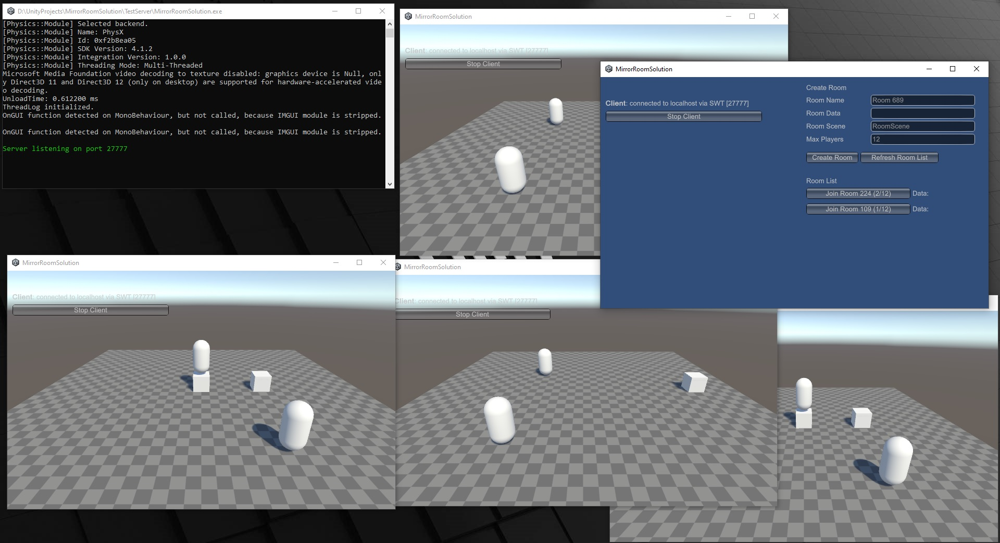

# Mirror Multi‑Room Manager

A lightweight, single‑process solution for Mirror v96.0.1 (Unity 2020+) that lets you host **multiple isolated game rooms** on one server using Unity’s additive scenes and scene interest management.  
Players connect to a lobby and can join or create rooms (with custom name, data string, scene, max‑player count). Each room will have all network traffic (spawns, RPCs, transforms) scoped only to that room's scene.

Think of this solution as a server authoritive (and free) alternative to Photon.
This solution follows the KISS design principle (Keep it simple, stupid).

**Features**  
- Dynamic room creation & destruction with automatic server‑side cleanup  
- SceneInterestManagement–powered isolation: players in Room A can’t see or affect Room B  
- Basic lobby example ( that uses OnGUI ) for creating a room or joining an existing room from the room list  
- Player prefab swapping (`ReplacePlayerForConnection`), LobbyNetworkPlayer & RoomNetworkPlayer prefabs
- Auto‑unload of empty rooms and client room‑scene cleanup on disconnect  
- One server, one port, multiple isolated rooms  

